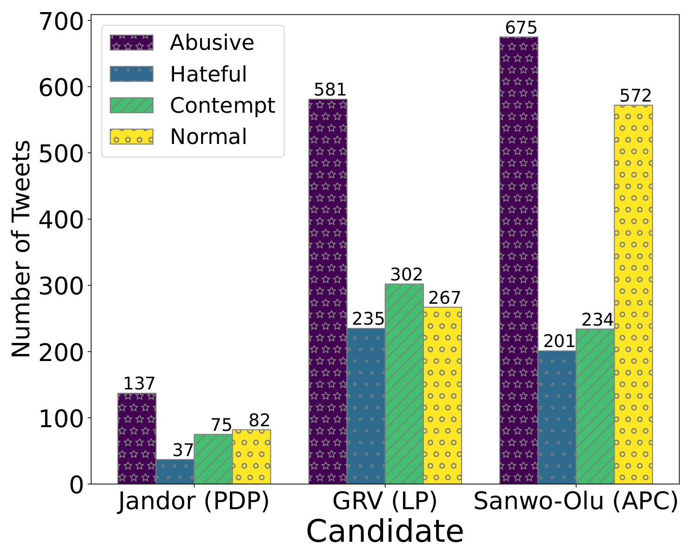

# EkoHate: Abusive Language and Hate Speech Detection for Code-switched Political Discussions on Nigerian Twitter

This repo contains the dataset and code for the above titled paper published at WOAH'24 (colocated with NAACL 2024). 
Nigerians have a notable online presence and actively discuss political and topical matters. This was particularly evident throughout the 2023 general election, where Twitter was used for campaigning, fact-checking and verification, and even positive and negative discourse. However, little or none has been done in the detection of abusive language and hate speech in Nigeria. In this paper, we curated code-switched Twitter data directed at three musketeers of the governorship election on the most populous and economically vibrant state in Nigeria; Lagos state, with the view to detect offensive speech in political discussions.

<p align="center">
  <span style="display:inline-block; text-align:center; width:45%;">
    
  </span>  
  <span style="display:inline-block; text-align:center; width:45%;">
    
  </span>
<br/>
      Figures 1 and 2: 
</p>


If you use our data, please cite this paper
```
@misc{ilevbare2024ekohate,
      title={EkoHate: Abusive Language and Hate Speech Detection for Code-switched Political Discussions on Nigerian Twitter}, 
      author={Comfort Eseohen Ilevbare and Jesujoba O. Alabi and David Ifeoluwa Adelani and Firdous Damilola Bakare and Oluwatoyin Bunmi Abiola and Oluwaseyi Adesina Adeyemo},
      year={2024},
      eprint={2404.18180},
      archivePrefix={arXiv},
}
```
